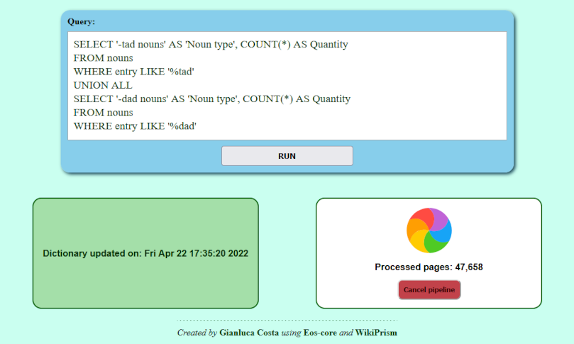

# Jardinero - Frontend

_Pluggable, React-based frontend for Jardinero_



[Jardinero](https://github.com/giancosta86/Jardinero) is a hybrid web architecture devoted to _linguistic analysis_ - and this package provides its **pluggable frontend**.

The main reasons for having a _separate package_ are:

- **clarity** and **separation of concerns**: Jardinero - which already consists of a fairly _sophisticated_ project - can now focus just on the underlying backend

- **reusability**: no matter the current backend technology, the frontend remains the same - communicating via _websockets_

## Installation

```bash
yarn add @giancosta86/jardinero-frontend
```

## Available bin scripts

- ```bash
  start-jardinero-frontend [<port>]
  ```

  Starts the development server, listening to the given **\<port\>** (defaulting to **8080**)

- ```bash
  copy-jardinero-frontend <target directory>
  ```

  Copies all the distributable files to the given **\<target directory\>** - creating it as needed.

**Please, note**: you can also start the **Webpack dev server** - just by running the project's **start** script:

```bash
yarn start
```

## Special thanks

- [Rainbow loader](https://icons8.com/preloaders/en/circular/rainbow/) from [Preloaders.net](https://icons8.com/preloaders/)
