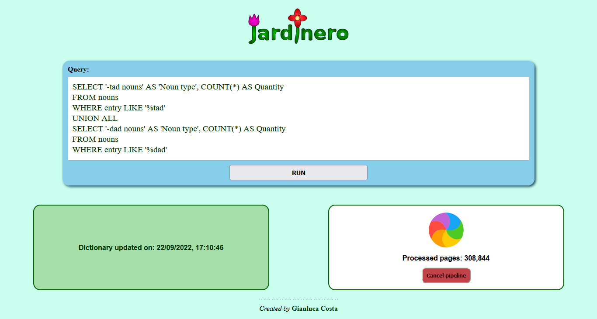

# Jardinero - Frontend

_Pluggable, React-based frontend for Jardinero_


[](https://badge.fury.io/js/@giancosta86%2Fjardinero-frontend)
[](/LICENSE)



**Jardinero** - in both its [TypeScript edition for NodeJS](https://github.com/giancosta86/JardineroJS) and its [Flask-based Python edition](https://github.com/giancosta86/Jardinero) - is a web stack devoted to _linguistic analysis_, whose **pluggable frontend** is provided by this project.

The main reasons for having a _dedicated frontend package_ are:

- **clarity** and **separation of concerns**: Jardinero - which already consists of a fairly _sophisticated_ stack - can now focus just on the underlying backend

- **reusability**: whatever the current backend technology, _the frontend remains the very same_ - communicating via _websockets_

**jardinero-frontend** is actually a triple package, because it contains:

- the **ready-made website**, that can be installed as a set of static files into another project

- **utility scripts** to easily plug the frontend into existing tech stacks

- a **TypeScript library** - containing _message names_ and _payloads_ - for the _TypeScript-based backend_

## Installation

```bash
npm install @giancosta86/jardinero-frontend
```

or

```bash
yarn add @giancosta86/jardinero-frontend
```

The public API entirely resides in the root package index, so you shouldn't reference specific modules.

## Basic usage

### Starting the development server

To run the frontend development server - for example, on port **3000** - you may want to add the following line to your **scripts** section in **package.json**:

```json
"scripts": {
  "start-frontend": "jardinero-start-frontend 3000"
}
```

or, to be more sophisticated:

```json
"scripts": {
  "start-frontend": "concurrently \"jardinero-start-frontend 3000\" \"wait-on --delay 2000 --interval 1000 http://localhost:3000/\""
}
```

Consequently, your **start** script will probably become:

```json
"scripts": {
  "start": "concurrently \"yarn start-backend\" \"yarn start-frontend\"",
}
```

In your backend code, you'll need to:

- **redirect to the frontend development server** when in _development_ mode

- **serve the actual frontend files**, from a directory of _static files_, when in _production_ mode. To copy the frontend files to the aforementioned directory, please consider using the **jardinero-copy-frontend** script

### Development redirection

When in development mode, you should _redirect_ the traffic to the frontend development server.

Additionally, please remember to _activate CORS for websockets_ when in development mode.

## Communication protocol

### Query parameters

The query parameter that should be passed to the frontend is:

- **backend-port**: used **only** in _development_ mode - when the frontend runs on a dedicated port on _localhost_; it contains the port of the backend server, used for _websocket_ communication

### WebSocket messages - From frontend to backend

The backend **must** handle a few websocket messages:

- **dictionary_status_request** - requests the current status of the dictionary - including whether a pipeline is running

- **start_pipeline** - tries to start the pipeline for creating a new copy of the dictionary

- **cancel_pipeline** - tries to cancel a running pipeline, if any

- **run_command(command: string)** - runs a command (usually, a SQL string) on the plugin loaded by the backend

### WebSocket messages - From backend to frontend

These are messages that the backend **can** (and should) send to the frontend:

- **dictionary_status_response**: returns the current status of the backend dictionary - including the status of the pipeline. It must contain a payload implementing the `DictionaryStatus` interface.

  This message can be sent after a **dictionary_status_request**, or in broadcast - upon specific background events such as dictionary updates

* **command_response** - sent as a response to **run_command**. It must contain a payload implementing the `CommandResponse` interface

## Available bin scripts

- ```bash
  start-jardinero-frontend [<port>]
  ```

  Starts the development server, listening to the given **\<port\>**, defaulting to **8080** - the very same port opened by Webpack upon `yarn start`

  **Please, note**: you can alternatively start the **Webpack dev server** - listening on port **8080** - just by running the project's **start** script:

  ```bash
  yarn start
  ```

  However, that requires access to the project's source directory - which is why the ready-made script is usually more convenient.

- ```bash
  copy-jardinero-frontend <target directory>
  ```

  Copies all the distributable files to the given **\<target directory\>** - creating it as needed.

## Special thanks

- [Rainbow loader](https://icons8.com/preloaders/en/circular/rainbow/) from [Preloaders.net](https://icons8.com/preloaders/)
